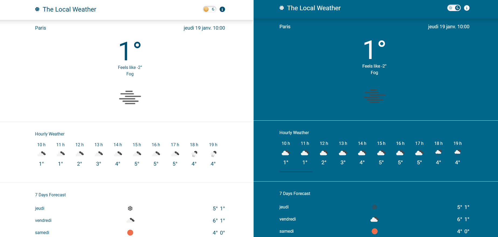

<a name="readme-top"></a>

[![MIT License][license-shield]][license-url]

<!-- PROJECT LOGO -->
<br />
<div align="center">

<h3 align="center">Local Weather</h3>

  <p align="center">
    Test project to learn vuejs 3
</div>

<!-- TABLE OF CONTENTS -->
<details>
  <summary>Table of Contents</summary>
  <ol>
    <li>
      <a href="#about-the-project">About The Project</a>
      <ul>
        <li><a href="#built-with">Built With</a></li>
      </ul>
    </li>
    <li>
      <a href="#getting-started">Getting Started</a>
      <ul>
        <li><a href="#prerequisites">Prerequisites</a></li>
        <li><a href="#installation">Installation</a></li>
      </ul>
    </li>
    <li><a href="#license">License</a></li>
    <li><a href="#contact">Contact</a></li>
  </ol>
</details>

<!-- ABOUT THE PROJECT -->

## About The Project

  <a href="https://github.com/fullasc/weather_app/blob/main/public/WeatherScreenshot.png">
    
  </a>

I wanted to have an introduction to VueJS, so I followed a youtube tutorial from [The Net Ninja](https://www.youtube.com/playlist?list=PL4cUxeGkcC9hfoy8vFQ5tbXO3vY0xhhUZ).
I also added a light/dark theme with the possibility to switch between theme.

<p align="right">(<a href="#readme-top">back to top</a>)</p>

### Built With

- [![Vue][Vue.js]][Vue-url]
- [![Tailwindcss][Tailwindcss.com]][Tailwindcss-url]

<p align="right">(<a href="#readme-top">back to top</a>)</p>

<!-- GETTING STARTED -->

## Getting Started

To get a local copy up and running follow these simple example steps.

### Prerequisites

This is an example of how to list things you need to use the software and how to install them.

- npm
  ```sh
  npm install npm@latest -g
  ```

### Installation

1. Get a free API Key

   - [OpenWeatherMap](https://openweathermap.org/api)
   - [Mapbox GeoCoding](https://docs.mapbox.com/api/search/geocoding/)

2. Clone the repo
   ```sh
   git clone https://github.com/fullasc/weather_app.git
   ```
3. Install NPM packages
   ```sh
   npm install
   ```
4. Rename `.env` file to `env.local` and add your API keys
   ```.env
   VITE_OPEN_WEATHER_API_KEY=ENTER YOUR API
   VITE_MAPBOX_API_KEY=ENTER YOUR API
   ```
5. Run the project
   ```sh
   npm run dev
   ```

<p align="right">(<a href="#readme-top">back to top</a>)</p>

<!-- LICENSE -->

## License

Distributed under the MIT License. See `LICENSE.txt` for more information.

<p align="right">(<a href="#readme-top">back to top</a>)</p>

<!-- CONTACT -->

## Contact

Project Link: [https://github.com/fullasc/weather_app](https://github.com/fullasc/weather_app)

<p align="right">(<a href="#readme-top">back to top</a>)</p>

<!-- MARKDOWN LINKS & IMAGES -->
<!-- https://www.markdownguide.org/basic-syntax/#reference-style-links -->

[license-shield]: https://img.shields.io/github/license/fullasc/weather_app.svg?style=for-the-badge
[license-url]: https://github.com/fullasc/weather_app/blob/main/LICENCE.txt
[product-screenshot]: public/WeatherScreenshot.png
[Vue.js]: https://img.shields.io/badge/Vue.js-35495E?style=for-the-badge&logo=vuedotjs&logoColor=4FC08D
[Vue-url]: https://vuejs.org/
[Tailwindcss.com]: https://img.shields.io/badge/Tailwind_CSS-38B2AC?style=for-the-badge&logo=tailwind-css&logoColor=white
[Tailwindcss-url]: https://tailwindcss.com/
